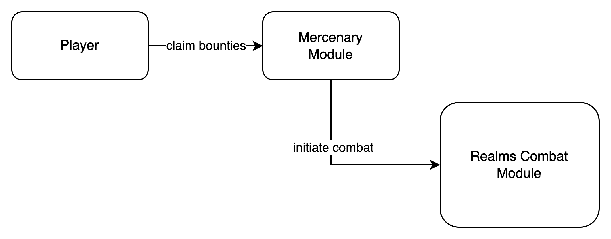
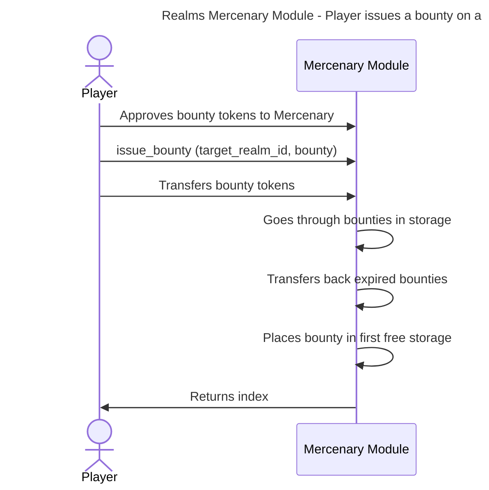
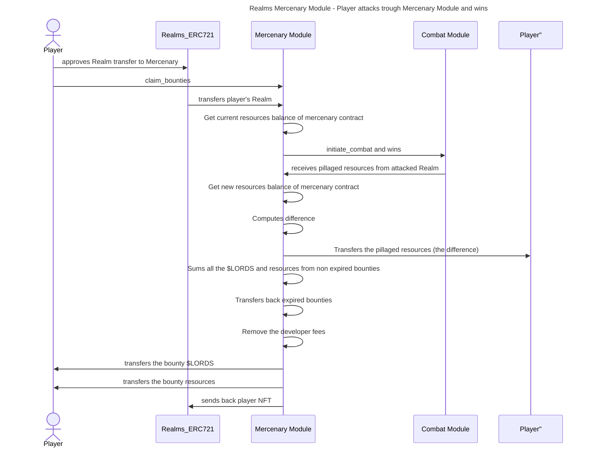

[](https://discord.gg/uQnjZhZPfu)
[](https://twitter.com/LootRealms)

<!-- badges -->
<p>
  <a href="https://starkware.co/">
    
  </a>
  <a href="https://github.com/anonmyous-author/anonymous-code/blob/main/LICENSE.md">
    
  </a>
</p>

# Mercenary module for Realms 💰

<p align="center">

</p>

# Introduction 🏰

Mercenary is a module built for the [Realms Settling Game](https://github.com/BibliothecaForAdventurers/realms-contracts). The Realms project is developed around the idea of composable modules. Any developer can write a module and propose it to the community.
If the community decides to include it within the game, the module will receive write access to the other modules and the game expands.

# Summary ⚔️

The mercenary module allows players to set bounties on target Realms which other players can then claim by successfully attacking and winning against the target Realm. In order to verify that the player has indeed attacked and won the combat, the attack is performed through the mercenary module. The code of the contract module can be found [here](https://github.com/BibliothecaDAO/realms-contracts/blob/main/contracts/settling_game/modules/combat/Combat.cairo).

A summary diagram can be seen below:



# Motivation 🚀

The purpose of this module integration is to allow more ways for players to weaken an enemy Realm without having to attack it themselves. By permitting users to set bounties on each other, additional possible alliances and strategies arise.

Some of these use cases are:

- weakening an enemy Realm without travelling constraints
- weakening an enemy Realm without building an army
- collecting resources by playing as a mercenary

The bounty system allows for new game dynamics to arise, some of which we haven’t even discovered yet.

# High-Level Specification 🛠

The module is composed of a Mercenary smart contract to:

- issue a new bounty on a Realm
- attack a Realm through the smart contract to claim the bounties
- remove a bounty

## Allowed Tokens ⛓

The contract is compatible with 2 types of tokens:

- $LORDS ERC20 tokens. Contract code can be found [here](https://github.com/BibliothecaDAO/realms-contracts/blob/main/contracts/settling_game/tokens/Lords_ERC20_Mintable.cairo).
- Realms resources ERC1155 tokens. Contract can be found [here](https://github.com/BibliothecaDAO/realms-contracts/blob/main/contracts/settling_game/tokens/Resources_ERC1155_Mintable_Burnable.cairo).

One bounty can only hold one type of tokens. If a player wants to add multiple token types, one bounty per token needs to be issued.

For each of these tokens, a minimum amount is set in the contract so that the storage is not spammed with valueless bounties.

## Bounty Structure 💰

A bounty is composed of:

- owner: owner of the bounty
- amount: Uint256 bounty amount
- deadline: expiration block number
- type:
  - is_lords: 1 if $LORDS bounty, 0 if resources bounty
  - resource_id: Uint256 resource token id

## Contract Public Entrypoints 🛡

| name           | arguments                                                                 | description                                                                                                                                                                                                                                                                                                   |
| -------------- | ------------------------------------------------------------------------- | ------------------------------------------------------------------------------------------------------------------------------------------------------------------------------------------------------------------------------------------------------------------------------------------------------------- |
| issue_bounty   | target_realm_id, bounty                                                   | Adds a bounty on a target Realm and transfers the amount from the player to the mercenary contract                                                                                                                                                                                                            |
| remove_bounty  | index, target_realm_id                                                    | Removes a bounty, needs the index of the bounty and the target Realm id                                                                                                                                                                                                                                       |
| claim_bounties | target_realm_id, attacking_realm_id, attacking_army_id, defending_army_id | Attacks another realm through the mercenary contract. To do that the attacker’s Realm is first transferred to the mercenary contract, which then initiates a combat with the target Realm and finally transfers back the NFT to the attacker in addition to the pillaged resources and claimed bounty amounts |

## Sequence Diagrams 📜

### Issue a bounty



### Claim a bounty



## Royalties 👨‍💻

A royalty fee is taken from each bounty that is claimed. The royalty fee percentage can be changed by the owner at any time.

# Testing 🧪

All the entrypoints of the Mercenary contract are tested in [Protostar](https://docs.swmansion.com/protostar/). You can find the installation steps [here](https://docs.swmansion.com/protostar/docs/tutorials/installation).

**Install the dependencies**

```
protostar install
```

**Compile the contracts**

```
protostar build
```

**Run the tests**

```
protostar test
```

## Testing Progress

&nbsp;

| Entrypoint        | Tested in Protostar |
| ----------------- | ------------------- |
| issue_bounty      | ✅                  |
| claim_bounties    | ✅                  |
| remove_bounty     | ✅                  |
| transfer_dev_fees | ✅                  |
